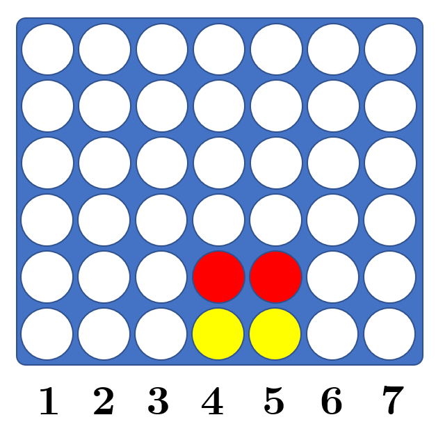
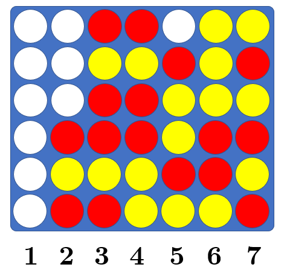

# Connect 4 Game Solver

This C++ source code is published under AGPL v3 license, originally  at [PascalPons' connect4 respository](https://github.com/PascalPons/connect4).

To test, run in a Unix environment.

Do:
```make & ./connect4solver [argument]```

The argument is a sequence of column numbers which the playeres have placed their chips in. For instance, the sequence 4455 corresponds to the following position, as described in the paper.



For example, one might try:

```
./connect4solver 43423322556654566777777364443365
```
 
 Which corresponds to the following position below.

 
 